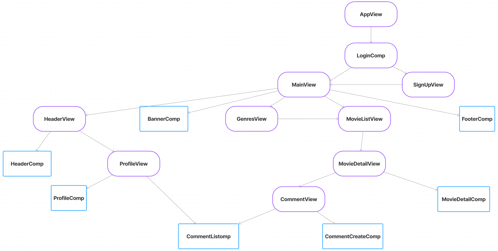
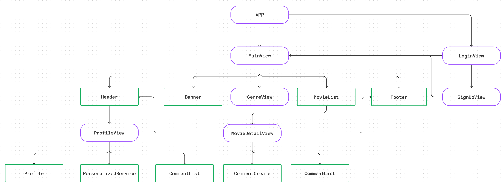
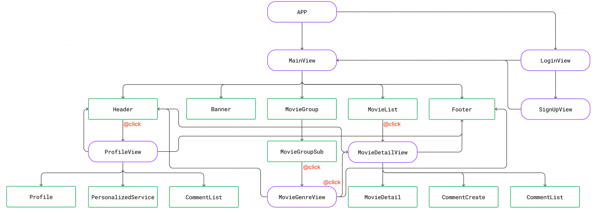
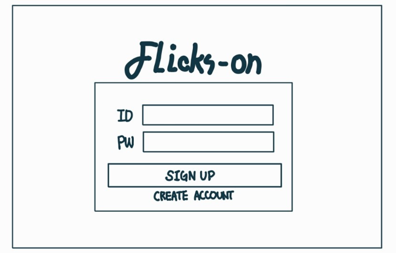
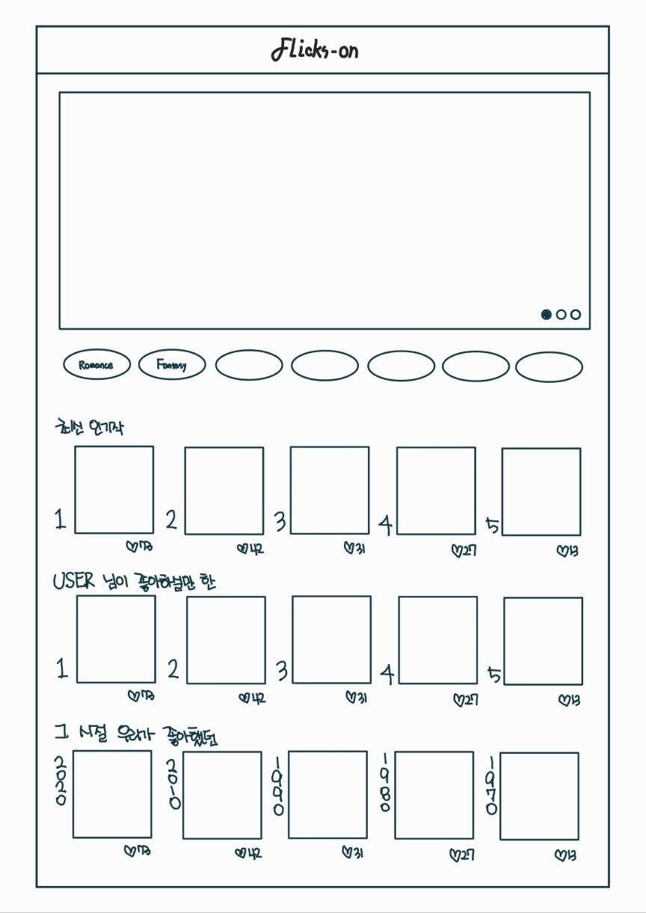
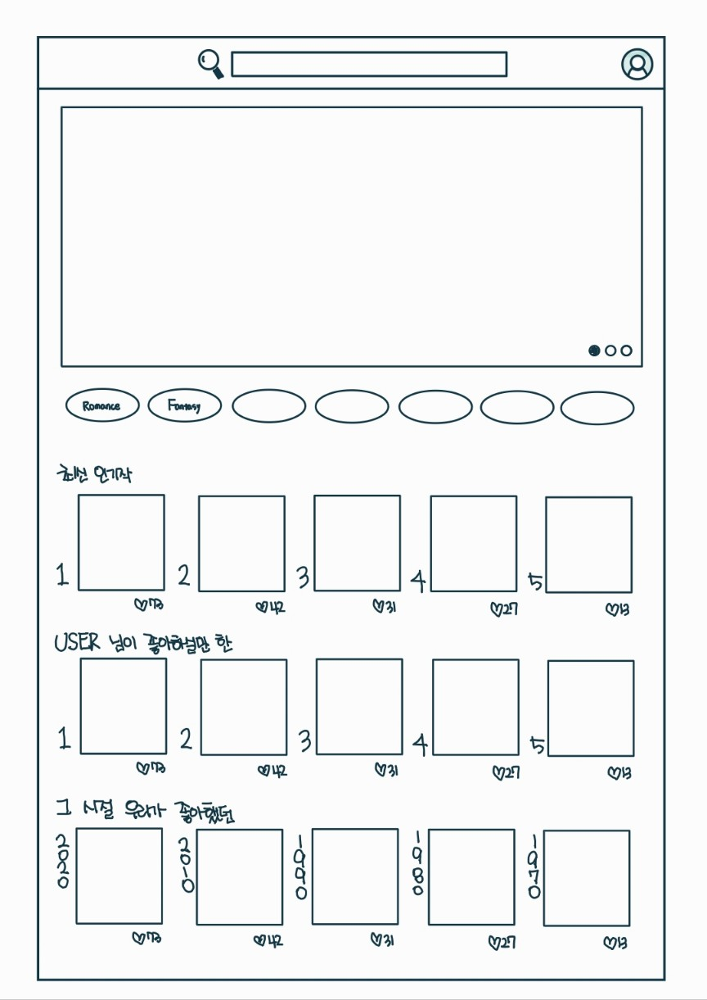
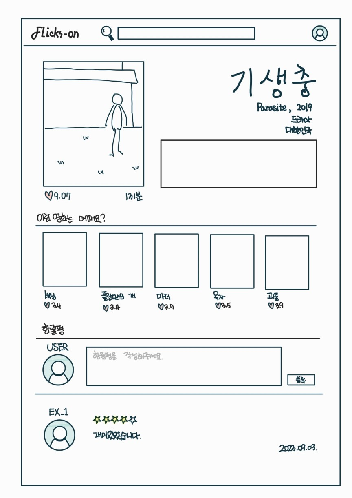
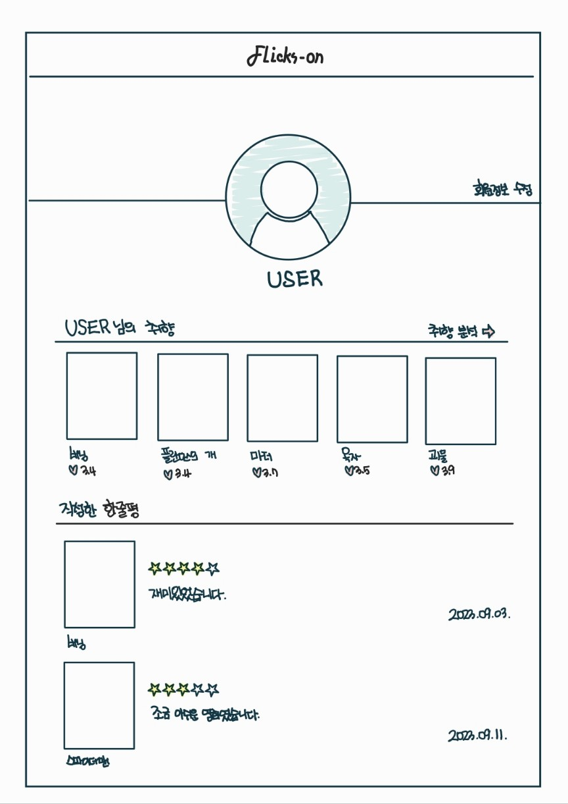
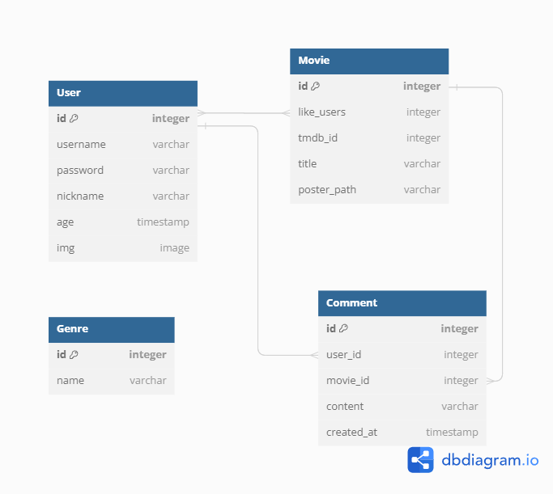
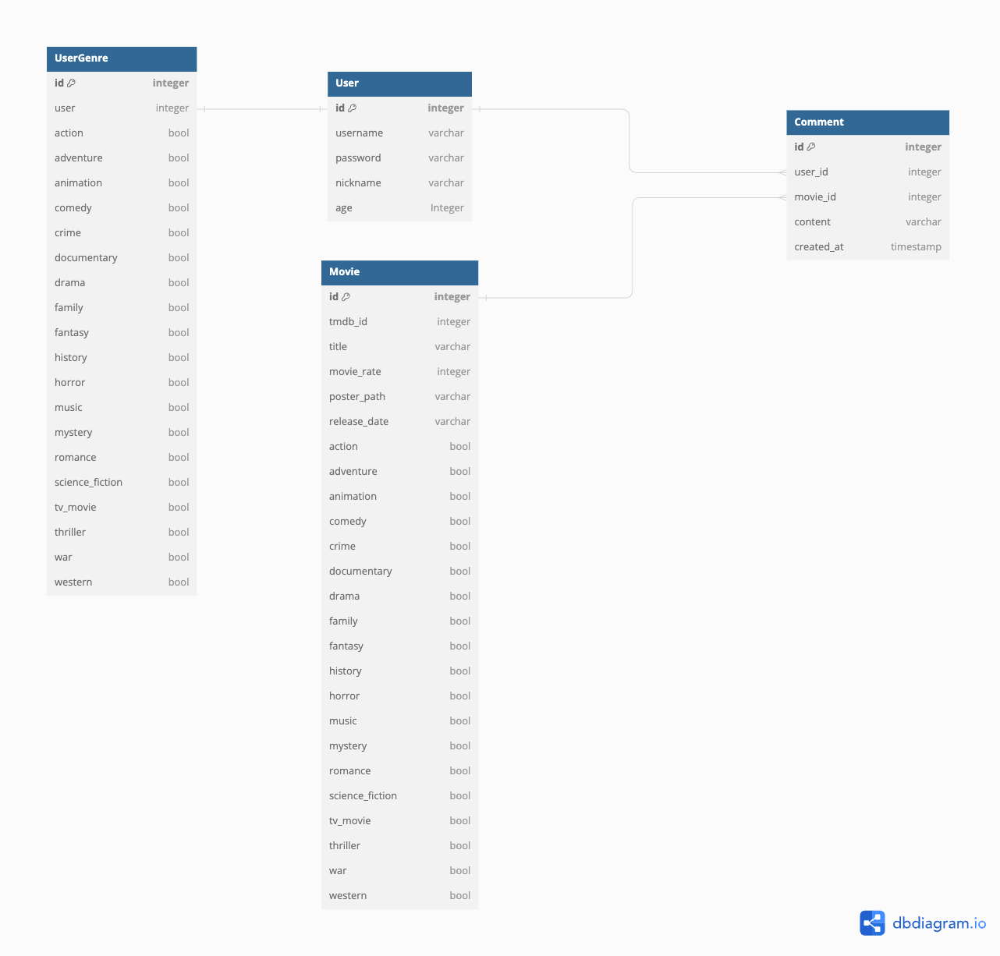

### TEAM

> `대전 2반 9조`
- 박수형
    - 구현 목록 초안
    - `Front, Back`
        - Comment CRUD
    - `Front`
        - Vue Components Tree 초안
        - 같은 route를 사용하는 컴포넌트 간 url로 이동 가능하게 구현
    - `Back`
        - ERD 1차 수정
        - 전체 Model 작성 및 TMDB API를 이용해 DB 데이터 작성
        - Login, SignUp 구현, 최초 로그인 시 취향을 설정할 수 있게 설정
        - rest-auth 커스텀 &rarr; user deatil serializer 커스텀
        - API 로 불러 온 영화 데이터 일부 조작
        - 취향을 기반으로 영화 추천 알고리즘 제작
        - 시리얼라이저 작성
    - `CSS`
        - 배너

- **전소현**
    - 구현 목록 1차 수정
    - `Logo` - 제작
    - `Front, Back`
        - Project, App 생성
        - Comment CRUD
    - `Front`
        - Vue Components Tree 1차 수정, 2차 수정 (완성)
        - Login, SignUp 제외, 전 페이지 초안 구현
        - API Data 불러오기 (현재 상영작, 인기작, 관련 영화, 검색 기능, 트레일러)
    - `Back`
        - ERD 초안
    - `CSS`
        - 헤더, 배너, 푸터, 영화 리스트 카드, 특정 영화 카드, 유튜브 트레일러, 댓글 CRUD 컴포넌트, 검색 페이지, 프로필 페이지
        - 로그인 페이지, 회원 가입 페이지, 취향 선택 페이지, 회원 정보 수정 페이지

### PLAN

1. 무엇을 개발할 것인가?
    - 주제 : 영화 추천 알고리즘 기반 커뮤니티 서비스
    - 특색
        - 아이디어
            1. 날씨 API : 날씨 데이터와 오늘의 기분을 기반으로 영화 추천
            2. 카카오 API : 영화 제목 + '리뷰' 을 검색해서 타사이트의 리뷰를 볼 수 있도록 함
            3. 카카오 API : AI 챗봇 사용
            4. 장르별 점수를 이용해서 영화의 평점을 계산해서 제일 높은 순으로 추천
        - 채택
            2. 카카오 API : 영화 제목 + '리뷰' 을 검색해서 타사이트의 리뷰를 볼 수 있도록 함
            4. 장르별 점수를 이용해서 영화의 평점을 계산해서 제일 높은 순으로 추천

     
2. 왜 개발하는 것인가?
    - 타겟 : 맞춤 영화 추천이 필요한 사람들
     
3. 어떻게 개발할 것인가?
    - 기술 스택 : Vue, Django
     
4. 일정 및 업무 부담
    - 23.11.16 (목) : 가이드 라인 확립 (설계서, 구조도, ERD, DB 등)
    - 23.11.17 (금)
        - `Front` : Components Tree 에 따라 Vue Project 구체화
        - `Back` : TMDB 데이터를 이용하여 Dummy Data 생성, Serializer 작성 후 의도대로 동작하는지 확인
    - 23.11.18~19(주말)
        - `Front` : Components Tree 변경 및 완성, 그에 따른 Vue Project 구체화 -> 전 페이지 초안 완성
        - `Back` : signup, login, 현재 로그인 하고 있는 유저의 정보 return 값 customizing
    - 23.11.20(월)
        - `Front` : Comment CRUD, API Data 불러오기 (현재 상영작, 인기작, 관련 영화)
        - `Back` : Comment CRUD
    - 23.11.21(화)
        - `Front` : 관련 영화 API 부분 디버깅, API Data 불러오기 (개봉 예정작, 검색 기능, 유튜브 트레일러)
        - `Back` :
        - `CSS` : 메인-영화 리스트, 헤더, 푸터, 디테일-영화 정보
    - 23.11.22(수)
        - `Front` : signup 함수 수정 &rarr; 최초 로그인 시 장르 선택, 같은 url에서 parameter만 수정한 url로 접속 시도 시 안되던 버그 수정 (디테일 페이지, 검색 페이지), 검색 페이지 엔터로 검색되게 버그 수정
        - `Back` : Comment Read 부분 버그 발생으로 인한 Serializer 수정
        - `CSS` : 각 페이지의 제목 메세지, 디테일-유튜브 트레일러, Comment CRUD, 프로필 페이지, 검색 페이지, 로그인 페이지, 회원 가입 페이지, 취향 선택 페이지, 회원 정보 수정 페이지
    - 23.11.23(목)
        - `Front` : 
        - `Back` : 
    - 23.11.24(금)
        - `Front` :
        - `Back` :
     
5. 진행해야 할 부분
    - 우선순위 상
        - [x]signup 추가 (취향 추천 알고리즘)

    - 우선순위 중하
        - 프로필 사진 추가 (추가 기능)   
        - signout 추가
        - [x]comment 생성 (추가 기능 &rarr; 새로고침 디버깅)
        - 선택한 장르를 기준으로 배너 이미지를 넣으면 어떨까

    - CSS
        - [x]배너 수정
        

### REFERENCE

[css animation](https://animate.style/) 
[css style](https://www.w3schools.com/css/css3_animations.asp)

### Front-End

- Components Tree 
    - 초안 
     
    - 1차 수정안 
     
    - 2차 수정안 
     

- UI/UX 
    
    |||
    |:--:|:--:|
    |||

### Back-End

- ERD (추후 수정 예정)  
    - 초안 
     

    - 1차 수정안 
     

    - 2차 수정안 
     

- 모델이 저장될 때 마다 tmdb 의 영화 id 가 있는지 확인 후 없는 경우에만 영화를 저장

### DB

[TMDB-API](https://developer.themoviedb.org/reference/intro/getting-started) 
[Youtube-API](https://console.cloud.google.com/marketplace/product/google/youtube.googleapis.com?q=search&referrer=search&project=new-project-404701) 
[Youtube-API 사용법](https://cocococo.tistory.com/entry/Youtube-API-%EC%9C%A0%ED%8A%9C%EB%B8%8C-API-%EB%8F%99%EC%98%81%EC%83%81-%EB%8D%B0%EC%9D%B4%ED%84%B0-%EA%B0%80%EC%A0%B8%EC%98%A4%EB%8A%94-%EB%B0%A9%EB%B2%95) 

 

### 구현 목록

|ID|Depth 1|Depth 2|내용|
|:--:|:--:|:--:|:--|
|`user`|로그인 / 회원관리|회원가입|아이디, 비밀번호, 이름, 사용자 이름 프로필 사진 첨부 가능 (미등록 시 기본 이미지) 이용 약관 동의 가입 완료 클릭 시 로그인 페이지로 이동|
|`user`|로그인 / 회원관리|로그인|아이디 비밀번호 입력 오류가 있으면 오류메시지 출력 로그인 완료 시 메인 페이지로 이동|
|`user`|로그인 / 회원관리|로그아웃|로그아웃 후 메인 페이지로 이동|
|`user`|프로필 페이지|회원정보 수정|아이디 변경 불가 이름, 이메일 변경 가능 사진 첨부 가능 수정 완료 후 프로필 페이지로 이동|
|`user`|프로필 페이지|비밀번호 변경|비밀번호 변경 후 프로필 페이지로 이동|
|`user`|프로필 페이지|회원 탈퇴|탈퇴 시 로그아웃 후 탈퇴 처리 메인 페이지로 이동|
|`movie`|영화 페이지|영화 메인 페이지|여러가지 분류(장르)에 따른 영화 리스트 제목, 평점 합계|
|`movie`|영화 페이지|영화 상세 페이지|특정 영화의 정보 열람 영화 제목, 장르, 평점 합계, 러닝타임 간단한 줄거리, 감독 및 출연, 관련 콘텐츠 유저 평점/한줄평|
|`movie`|영화 페이지|영화 추가|영화 정보 추가 관리자 계정만 사용 가능|
|`movie`|영화 페이지|영화 수정|영화 정보 수정 관리자 계정만 사용 가능|
|`movie`|영화 페이지|영화 삭제|영화 정보 삭제 관리자 계정만 사용 가능|
|`comment`|댓글 관리|댓글 작성|메인페이지에서 작성 가능 디테일 페이지에서 작성 가능|
|`comment`|댓글 관리|댓글 수정|수정하려는 페이지에서 수정 후 해당 부분만 불러오기|
|`comment`|댓글 관리|댓글 보기|해당 게시글 페이지에서만 출력 해당 댓글의 좋아요 수 출력 해당 댓글 좋아요 가능(토글) 해당 댓글 작성자, 댓글 내용 출력|
|`comment`|댓글 관리|댓글 삭제|작성자만 삭제 가능 삭제 후 해당 페이지의 그 부분만 새로고침 대댓글도 함께 삭제|
|`comment`|대댓글 관리|대댓글 작성|해당 글의 디테일 페이지에서만 가능|

 

### 추가 구현 목록 (리뷰-댓글 커뮤니티)

|ID|Depth 1|Depth 2|내용|
|:--:|:--:|:--:|:--|
|`user`|프로필 페이지|팔로우&언팔로우|본인의 페이지가 아니라면 팔로우 언팔로우 가능|
|`user`|프로필 페이지|팔로잉&팔로워|해당 유저가 팔로잉 하고 있는 유저의 숫자 해당 유저를 팔로워 하고 있는 유저의 숫자 누르면 유저 목록 표기|
|`user`|프로필 페이지|평점/한줄평 확인|해당 유저가 작성한 평점/한줄평을 보여줌|
|`review`|리뷰 관리|리뷰 메인 페이지|영화 상세 정보의 메인 리뷰 게시판 게시글의 title, comments 수, likes, 작성자 표기, 좋아요 수|
|`review`|리뷰 관리|리뷰 상세 페이지|리뷰 게시글의 상세 페이지 게시글의 title, contents, comments, likes, 작성자 표기 해당 리뷰 좋아요 가능(토글)|
|`review`|리뷰 관리|리뷰 게시|사진 첨부 가능, 내용 첨부 가능 생성 후 해당 리뷰 상세 페이지로 이동|
|`review`|리뷰 관리|리뷰 수정|사진 수정 가능, 내용 수정 가능 수정 후 해당 리뷰 상세 페이지로 이동 게시글 작성자만 수정 가능|
|`review`|리뷰 관리|리뷰 삭제|해당 리뷰 작성자만 삭제 가능 삭제 후 메인 페이지로 이동|
|`comment`|대댓글 관리|대댓글 삭제|해당 글의 디테일 페이지에서만 가능 해당 대댓글의 작성자만 삭제 가능|
|`comment`|대댓글 관리|대댓글 수정|해당 글의 디테일 페이지에서만 가능 해당 대댓글의 작성자만 수정 가능|
|`comment`|대댓글 관리|대댓글 보기|해당 글의 디테일 페이지에서만 가능 좋아요 수 출력 해당 대댓글 좋아요 기능(토글)|
|`likes`|좋아요|리뷰 좋아요|리뷰의 좋아요 기능(토글)|
|`likes`|좋아요|댓글/대댓글 좋아요|댓글/대댓글의 좋아요 기능(토글)|
|`likes`|좋아요|영화 좋아요|영화의 좋아요 기능(토글)|
|`hash`|해쉬태그|해쉬태그|영화를 장르에 따라 분류 추천 알고리즘 구현 필요|
 